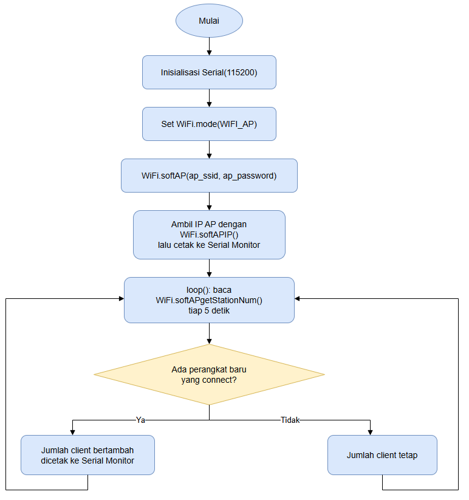

# Praktikum Internet of Things (TK245005)
## Modul 2 – Konfigurasi Jaringan

| | |
|---|---|
| Nama | Ardina Jihan Mariska |
| NIM | H1H024018 |
| Shift | B |
| Modul | 2 – konfigurasi Jaringan |

---
Modul 2 ini membahas konfigurasi jaringan WiFi pada perangkat IoT menggunakan board ESP8266. Ada dua percobaan utama yang dilakukan, yaitu mengonfigurasi ESP8266 sebagai Station (STA) yang menyambung ke jaringan WiFi yang sudah ada, dan mengonfigurasi ESP8266 sebagai Access Point (AP) yang menyediakan jaringannya sendiri agar bisa diakses langsung oleh perangkat lain seperti smartphone.

Modul praktikum yang diberikan aslinya ditulis untuk board ESP32 dengan pustaka WiFi.h, tetapi board yang dipakai pada praktikum ini adalah ESP8266, sehingga pustaka yang digunakan diganti menjadi ESP8266WiFi.h. Nama fungsi yang dipakai (WiFi.mode, WiFi.begin, WiFi.status, WiFi.localIP, WiFi.macAddress, WiFi.RSSI, WiFi.softAP, WiFi.softAPIP, WiFi.softAPgetStationNum) tetap sama persis dengan versi ESP32, sehingga logika program tidak berubah.

## Alat dan Bahan

- Board ESP8266 (NodeMCU) 1 buah
- Kabel USB Micro-USB
- Laptop dengan Arduino IDE yang sudah terpasang board manager ESP8266
- Jaringan WiFi (hotspot smartphone) beserta SSID dan password
- Smartphone untuk menguji koneksi ke Access Point ESP8266
- LED 1 buah dan resistor 220 Ohm sebagai indikator status koneksi (opsional)

## Library atau Dependencies

- ESP8266WiFi.h, bawaan dari board manager ESP8266 di Arduino IDE, menyediakan seluruh fungsi untuk mengatur mode WiFi, memulai koneksi Station, membuat Access Point, dan membaca parameter jaringan seperti IP address, MAC address, dan RSSI.

## Percobaan 2A: Konfigurasi Mode Station (STA)

### Tujuan Percobaan

Memahami dan mengimplementasikan konfigurasi ESP8266 pada mode Station (STA) agar dapat terhubung ke jaringan WiFi yang sudah tersedia, sekaligus membaca informasi IP address, MAC address, dan kekuatan sinyal (RSSI) dari koneksi tersebut.

### Rangkaian

LED indikator dipasang di pin GPIO 4 melalui resistor 220 Ohm, kaki LED yang satunya lagi dihubungkan ke GND. LED ini berfungsi sebagai penanda visual, menyala saat ESP8266 berhasil terhubung ke WiFi dan mati saat terputus.


### Kode Program

```
#include <ESP8266WiFi.h>

const char* ssid     = "Kelompok1ShiftB";
const char* password = "admin321";

const int ledPin = 4;   // LED indikator status koneksi

void setup() {
  Serial.begin(115200);
  pinMode(ledPin, OUTPUT);
  digitalWrite(ledPin, LOW);

  // Set mode WiFi menjadi Station
  WiFi.mode(WIFI_STA);
  WiFi.begin(ssid, password);

  Serial.print("Menghubungkan ke WiFi");
  while (WiFi.status() != WL_CONNECTED) {
    delay(500);
    Serial.print(".");
  }

  // Jika berhasil terhubung
  Serial.println();
  Serial.println("WiFi berhasil terhubung!");
  Serial.print("IP Address  : ");
  Serial.println(WiFi.localIP());
  Serial.print("MAC Address : ");
  Serial.println(WiFi.macAddress());
  Serial.print("RSSI (dBm)  : ");
  Serial.println(WiFi.RSSI());

  digitalWrite(ledPin, HIGH);  // nyalakan LED sebagai indikator
}

void loop() {
  // Cek status koneksi setiap 5 detik
  if (WiFi.status() == WL_CONNECTED) {
    Serial.println("Status: Terhubung");
  } else {
    Serial.println("Status: Terputus");
    digitalWrite(ledPin, LOW);
  }
  delay(5000);
}
```

### Penjelasan Kode

Baris include ESP8266WiFi.h memanggil pustaka WiFi bawaan core ESP8266 agar board bisa berkomunikasi dengan jaringan WiFi, fungsinya setara dengan WiFi.h pada ESP32.

Variabel ssid dan password menyimpan nama dan kata sandi jaringan WiFi yang akan disambungkan. Variabel ledPin menentukan pin GPIO yang dipakai sebagai indikator status koneksi.

### Penjelasan Setiap Fungsi

Serial.begin(115200) mengaktifkan komunikasi serial antara ESP8266 dan komputer dengan baud rate 115200, supaya proses koneksi bisa dipantau lewat Serial Monitor.

pinMode(ledPin, OUTPUT) menetapkan pin LED sebagai keluaran digital, lalu digitalWrite(ledPin, LOW) memastikan LED dalam kondisi mati saat program pertama kali dijalankan.

WiFi.mode(WIFI_STA) mengatur ESP8266 agar berjalan dalam mode Station, artinya ESP8266 akan berperan sebagai klien yang menyambung ke access point lain, bukan membuat jaringannya sendiri.

WiFi.begin(ssid, password) memulai proses koneksi ke jaringan WiFi yang namanya sesuai variabel ssid, menggunakan password yang sudah ditentukan.

WiFi.status() mengembalikan status koneksi WiFi saat ini, nilai WL_CONNECTED menandakan koneksi sudah berhasil.

WiFi.localIP() mengembalikan alamat IP yang diberikan router kepada ESP8266 setelah koneksi berhasil.

WiFi.macAddress() mengembalikan alamat MAC unik dari modul WiFi ESP8266.

WiFi.RSSI() mengembalikan kekuatan sinyal WiFi yang diterima ESP8266, dalam satuan dBm, nilai yang mendekati nol menandakan sinyal semakin kuat.

digitalWrite(ledPin, HIGH) dan digitalWrite(ledPin, LOW) dipakai untuk menyalakan dan mematikan LED sesuai status koneksi.

delay(500) dan delay(5000) dipakai untuk memberi jeda antar pengecekan, supaya proses tidak dilakukan secara terus-menerus tanpa jeda.

### Penjelasan Percabangan atau Conditional

Perulangan while (WiFi.status() != WL_CONNECTED) akan terus berjalan selama status koneksi belum WL_CONNECTED, di dalamnya program menunggu 500 milidetik lalu mencetak tanda titik ke Serial Monitor sebagai tanda proses masih berlangsung. Perulangan ini berhenti begitu status koneksi berubah menjadi WL_CONNECTED.

Pada fungsi loop, terdapat percabangan if (WiFi.status() == WL_CONNECTED) yang mengecek apakah koneksi masih aktif setiap 5 detik. Jika kondisi benar, program mencetak Status: Terhubung. Jika kondisi salah, artinya koneksi sudah terputus, program mencetak Status: Terputus dan mematikan LED melalui digitalWrite(ledPin, LOW).

### Jawaban Pertanyaan Praktikum

1) Gambarkan diagram alur (flowchart) proses koneksi ESP8266 ke jaringan WiFi pada program di atas.

Jawaban: 
 Alur program dimulai dari inisialisasi Serial dan pin LED, kemudian WiFi diatur ke mode Station dan WiFi.begin dipanggil. Program lalu memasuki perulangan yang mengecek status koneksi setiap 500 milidetik sambil mencetak tanda titik, sampai status berubah menjadi WL_CONNECTED. Setelah terhubung, program mencetak IP address, MAC address, dan RSSI, lalu menyalakan LED. Selanjutnya pada loop, status koneksi terus dipantau tiap 5 detik dan LED disesuaikan dengan status tersebut. 

2) Apa fungsi dari perintah WiFi.mode(WIFI_STA) pada program tersebut?

Jawaban: Perintah ini mengatur mode operasi WiFi ESP8266 agar berperan sebagai klien atau Station, yang akan mencari dan menyambung ke jaringan WiFi lain yang sudah ada, bukan membuat jaringan sendiri.

3) Jelaskan apa yang terjadi apabila SSID atau password yang dimasukkan salah.

Jawaban: Apabila SSID atau password salah, fungsi WiFi.begin tetap dipanggil tetapi status koneksi tidak akan pernah menjadi WL_CONNECTED, sehingga program akan tertahan pada perulangan while dan terus mencetak tanda titik tanpa henti, karena program dasar tidak memiliki mekanisme timeout. Jika passwordnya yang salah, ESP8266 sebenarnya menemukan jaringan tersebut tetapi gagal pada proses autentikasi. Jika SSID-nya yang salah, ESP8266 sama sekali tidak menemukan jaringan dengan nama tersebut.

4) Modifikasi program agar ESP8266 mencoba menghubungkan ulang (reconnect) secara otomatis apabila koneksi WiFi terputus.

Jawaban, kode yang dimodifikasi:

```
#include <ESP8266WiFi.h>

const char* ssid     = "Kelompok1ShiftB";
const char* password = "admin321";
const int ledPin = 2;

unsigned long lastCheck = 0;
const unsigned long interval = 5000; // cek tiap 5 detik

void setup() {
  Serial.begin(115200);
  pinMode(ledPin, OUTPUT);
  WiFi.mode(WIFI_STA);
  WiFi.begin(ssid, password);
  Serial.println("Menghubungkan ke WiFi...");
}

void loop() {
  unsigned long now = millis();
  if (now - lastCheck >= interval) {
    lastCheck = now;
    if (WiFi.status() == WL_CONNECTED) {
      Serial.println("Status: Terhubung");
      digitalWrite(ledPin, HIGH);
    } else {
      // Jika terputus, coba sambungkan ulang otomatis
      Serial.println("Status: Terputus, mencoba reconnect...");
      digitalWrite(ledPin, LOW);
      WiFi.disconnect();
      WiFi.begin(ssid, password);
    }
  }
}
```

Penjelasan modifikasi: variabel lastCheck dan interval dipakai sebagai pengganti delay, dengan memanfaatkan fungsi millis sebagai penghitung waktu non-blocking, sehingga program tidak terhenti total saat menunggu. Setiap 5 detik, program mengecek status koneksi. Jika terhubung, LED dinyalakan seperti biasa. Jika status bukan WL_CONNECTED, program mencetak pesan sedang mencoba reconnect, mematikan LED, memanggil WiFi.disconnect untuk membersihkan sesi lama, lalu memanggil WiFi.begin lagi untuk mencoba menyambung ulang secara otomatis tanpa perlu menekan tombol reset pada board.

## Percobaan 2B: Konfigurasi Mode Access Point (AP)

### Tujuan Percobaan

Memahami dan mengimplementasikan konfigurasi ESP8266 sebagai Access Point yang dapat diakses langsung oleh perangkat lain seperti smartphone, tanpa memerlukan router eksternal, serta memantau jumlah perangkat yang terhubung ke jaringan tersebut.

### Rangkaian

Percobaan ini tidak memerlukan komponen tambahan selain board ESP8266 itu sendiri, karena Access Point dibuat langsung oleh modul WiFi internal ESP8266.

### Kode Program

```
#include <ESP8266WiFi.h>

const char* ap_ssid     = "ESP8266_AccessPoint";
const char* ap_password = "12345678"; // minimal 8 karakter

void setup() {
  Serial.begin(115200);

  // Set mode WiFi menjadi Access Point
  WiFi.mode(WIFI_AP);
  WiFi.softAP(ap_ssid, ap_password);

  IPAddress apIP = WiFi.softAPIP();
  Serial.println("Access Point aktif!");
  Serial.print("SSID       : ");
  Serial.println(ap_ssid);
  Serial.print("IP Address : ");
  Serial.println(apIP);
}

void loop() {
  // Menampilkan jumlah perangkat yang terhubung setiap 5 detik
  int jumlahClient = WiFi.softAPgetStationNum();
  Serial.print("Jumlah perangkat terhubung: ");
  Serial.println(jumlahClient);
  delay(5000);
}
```

### Penjelasan Kode

Variabel ap_ssid dan ap_password menentukan nama jaringan dan kata sandi yang akan dibuat oleh ESP8266. Password minimal harus 8 karakter agar bisa dipakai pada enkripsi WPA2.

### Penjelasan Setiap Fungsi

WiFi.mode(WIFI_AP) mengatur ESP8266 agar berperan sebagai penyedia jaringan atau hotspot, bukan sebagai klien.

WiFi.softAP(ap_ssid, ap_password) mengaktifkan Access Point dengan SSID dan password yang sudah ditentukan sebelumnya.

WiFi.softAPIP() mengembalikan alamat IP default dari Access Point yang dibuat, nilai ini kemudian disimpan ke variabel apIP dan dicetak ke Serial Monitor.

WiFi.softAPgetStationNum() mengembalikan jumlah perangkat yang sedang terhubung ke Access Point pada saat fungsi ini dipanggil, dipakai di dalam loop untuk memantau jumlah client secara berkala.

### Penjelasan Percabangan atau Conditional

Program pada percobaan 2B ini tidak memiliki percabangan if-else, karena tujuannya hanya membuat Access Point dan menampilkan jumlah client secara terus-menerus setiap 5 detik menggunakan delay, tanpa perlu mengambil keputusan berdasarkan kondisi tertentu.

### Jawaban Pertanyaan Praktikum

1) Mengapa alamat IP default Access Point pada ESP8266 umumnya bernilai 192.168.4.1?

Jawaban: Alamat 192.168.4.1 adalah alamat IP default yang sudah ditentukan oleh SDK/library WiFi bawaan Espressif untuk mode Access Point, berada pada rentang IP privat kelas C yang memang dialokasikan untuk jaringan lokal. Nilai ini dipakai sebagai default supaya developer tidak perlu mengatur IP secara manual saat membuat Access Point sederhana, meskipun tetap bisa diubah menggunakan fungsi WiFi.softAPConfig jika diperlukan.

2) Apa perbedaan mendasar antara mode Station dan mode Access Point pada ESP8266?

Jawaban: Pada mode Station, ESP8266 berperan sebagai klien yang menyambung ke jaringan WiFi yang sudah ada, sehingga mendapat IP dari router tersebut. Pada mode Access Point, ESP8266 sendiri yang membuat dan menyediakan jaringan WiFi, sehingga perangkat lain bisa langsung terhubung ke ESP8266 tanpa memerlukan router eksternal. Sederhananya, mode Station menjadikan ESP8266 sebagai tamu pada jaringan orang lain, sedangkan mode Access Point menjadikan ESP8266 sebagai tuan rumah yang menyediakan jaringannya sendiri.

3) Jelaskan risiko keamanan apabila password Access Point tidak diberikan atau terlalu sederhana.

Jawaban: Apabila Access Point dibuat tanpa password atau dengan password yang terlalu sederhana, jaringan tersebut sangat rentan diakses oleh pihak yang tidak berwenang. Risikonya antara lain data yang dikirim bisa disadap karena tidak terenkripsi dengan baik, jaringan bisa disusupi perangkat asing yang membebani sumber daya ESP8266, dan jika Access Point tersebut dipakai untuk provisioning atau kendali perangkat IoT, pihak luar bisa mengakses dan mengubah konfigurasi perangkat tanpa izin.

4) Modifikasi program agar ESP8266 berjalan pada mode AP+STA.

Jawaban, kode yang dimodifikasi:

```
#include <ESP8266WiFi.h>

const char* sta_ssid     = "Kelompok1ShiftB";
const char* sta_password = "admin321";

const char* ap_ssid     = "ESP8266_AccessPoint";
const char* ap_password = "12345678";

void setup() {
  Serial.begin(115200);

  // Set mode gabungan AP + STA
  WiFi.mode(WIFI_AP_STA);

  // Aktifkan Access Point
  WiFi.softAP(ap_ssid, ap_password);
  Serial.print("AP IP Address   : ");
  Serial.println(WiFi.softAPIP());

  // Sambungkan ke jaringan WiFi rumah sebagai Station
  WiFi.begin(sta_ssid, sta_password);
  Serial.print("Menghubungkan ke WiFi rumah");
  while (WiFi.status() != WL_CONNECTED) {
    delay(500);
    Serial.print(".");
  }
  Serial.println();
  Serial.print("STA IP Address  : ");
  Serial.println(WiFi.localIP());
}

void loop() {
  int jumlahClient = WiFi.softAPgetStationNum();
  Serial.print("Client pada AP: ");
  Serial.print(jumlahClient);
  Serial.print(" | Status STA: ");
  Serial.println(WiFi.status() == WL_CONNECTED ? "Terhubung" : "Terputus");
  delay(5000);
}
```

Penjelasan modifikasi: WiFi.mode(WIFI_AP_STA) mengaktifkan dua mode sekaligus, ESP8266 berfungsi sebagai Access Point sekaligus sebagai Station dalam waktu bersamaan. WiFi.softAP tetap dipanggil untuk mengaktifkan sisi Access Point, dan IP-nya dicetak menggunakan WiFi.softAPIP. Setelah itu WiFi.begin dipanggil untuk menyambung ke jaringan WiFi rumah sebagai klien, dan program menunggu sampai koneksi berhasil sebelum melanjutkan ke loop. Pada loop, program mencetak dua informasi sekaligus setiap 5 detik, yaitu jumlah client yang terhubung ke sisi Access Point dan status koneksi pada sisi Station, sehingga kedua peran ESP8266 bisa dipantau secara bersamaan. Mode gabungan ini cocok dipakai pada skenario provisioning, misalnya pengguna menyambung ke Access Point ESP8266 dulu untuk mengatur kredensial WiFi rumah, sementara ESP8266 tetap bisa terhubung ke internet melalui sisi Station-nya.

## Pertanyaan Analisis

1) Uraikan hasil tugas pada praktikum yang telah dilakukan pada setiap percobaan.

Jawaban: Pada Percobaan 2A, ESP8266 berhasil dikonfigurasi sebagai Station dan terhubung ke jaringan WiFi yang sudah ditentukan, dengan IP address, MAC address, dan RSSI yang berhasil ditampilkan di Serial Monitor, serta LED indikator menyala sesuai spesifikasi. Pengujian tambahan dengan SSID atau password yang salah menunjukkan program dasar akan tertahan tanpa mekanisme timeout, sehingga dibuat modifikasi program dengan fitur reconnect otomatis berbasis millis. Pada Percobaan 2B, ESP8266 berhasil dikonfigurasi sebagai Access Point dengan SSID dan IP default yang sesuai, dan jumlah perangkat yang terhubung berhasil dipantau secara real-time melalui Serial Monitor. Kedua percobaan berjalan lancar tanpa kendala berarti.

2) Bagaimana pengaruh kekuatan sinyal (RSSI) terhadap kestabilan koneksi WiFi pada perangkat IoT?

Jawaban: RSSI menunjukkan seberapa kuat sinyal WiFi yang diterima perangkat, dalam satuan dBm, dengan nilai yang mendekati nol berarti sinyal semakin kuat. Semakin kuat RSSI, koneksi cenderung lebih stabil, transfer data lebih cepat, dan risiko putus koneksi lebih rendah. Sebaliknya, RSSI yang lemah membuat koneksi mudah terputus, laju transfer data menurun, dan perangkat IoT bisa mengalami delay atau kegagalan pengiriman data ke server.

3) Bagaimana cara kerja ESP8266 dalam membedakan peran sebagai klien (Station) dan sebagai penyedia jaringan (Access Point)?

Jawaban: ESP8266 membedakan kedua peran tersebut melalui pengaturan mode WiFi yang ditentukan dengan fungsi WiFi.mode. Saat mode diatur ke WIFI_STA, chip WiFi internal dikonfigurasi untuk melakukan proses scanning dan asosiasi ke access point eksternal layaknya klien biasa. Saat mode diatur ke WIFI_AP, chip WiFi yang sama justru dikonfigurasi untuk memancarkan sinyal SSID sendiri, menjalankan server DHCP internal untuk membagikan IP ke perangkat yang terhubung, serta menangani proses autentikasi perangkat lain. Kedua peran ini bisa berjalan bersamaan dengan mode WIFI_AP_STA.

4) Bagaimana kombinasi mode Station dan Access Point (AP+STA) dapat dimanfaatkan dalam skenario nyata sistem IoT, misalnya pada proses konfigurasi awal perangkat (provisioning)?

Jawaban: Mode AP+STA banyak dimanfaatkan pada skenario provisioning perangkat IoT, yaitu proses awal saat perangkat baru pertama kali digunakan dan belum memiliki kredensial WiFi rumah. ESP8266 pertama kali aktif dalam mode Access Point sehingga pengguna bisa langsung menyambungkan HP ke Access Point tersebut dan membuka halaman web konfigurasi untuk memasukkan SSID serta password WiFi rumah. Setelah kredensial disimpan, ESP8266 beralih menyambung ke jaringan WiFi rumah dalam mode Station, namun bisa saja tetap mempertahankan sisi Access Point-nya sebagai jalur konfigurasi cadangan. Pendekatan ini banyak dipakai pada perangkat smart home komersial, karena mempermudah pengguna awam melakukan setup WiFi tanpa harus menulis kredensial langsung ke dalam source code.

