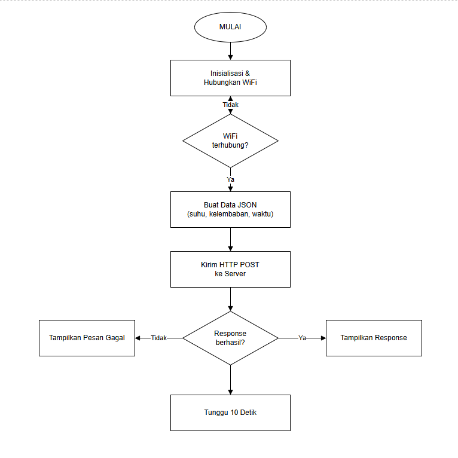

# Praktikum Internet of Things (TK245005)
## Modul 3 - Protokol Komunikasi HTTP dan MQTT dengan Format JSON

| | |
|---|---|
| Nama | Ardina Jihan Mariska |
| NIM | H1H024018 |
| Shift | B |
| Modul | 3 - Protokol Komunikasi (HTTP dan MQTT) |

---

Modul 3 ini membahas dua protokol komunikasi yang umum dipakai pada sistem IoT, yaitu HTTP dan MQTT, dengan data yang dipertukarkan diformat menggunakan JSON lewat pustaka ArduinoJson. Ada dua percobaan utama yang dilakukan, yaitu mengirim data suhu dan kelembaban dari board ke server menggunakan HTTP POST, dan mempublikasikan data yang sama ke broker MQTT publik menggunakan pola publish-subscribe.

Modul praktikum yang diberikan aslinya ditulis untuk board ESP32 dengan pustaka WiFi.h dan HTTPClient.h, tetapi board yang dipakai pada praktikum ini adalah ESP8266, sehingga pustaka yang digunakan disesuaikan menjadi ESP8266WiFi.h dan ESP8266HTTPClient.h. Karena endpoint yang dipakai pada percobaan HTTP (httpbin.org) memakai HTTPS, ditambahkan juga pustaka WiFiClientSecure.h beserta pemanggilan setInsecure() supaya ESP8266 bisa terhubung tanpa perlu validasi sertifikat SSL. Untuk percobaan MQTT, pustaka PubSubClient dan seluruh fungsinya sama persis dengan versi ESP32, sehingga logika program tidak berubah.

## Alat dan Bahan

- Board ESP8266 (NodeMCU) 1 buah
- Kabel USB Micro-USB
- Laptop dengan Arduino IDE yang sudah terpasang board manager ESP8266
- Jaringan WiFi yang terhubung ke internet
- Aplikasi client MQTT (HiveMQ WebSocket Client) untuk memverifikasi data yang dipublikasikan
- Broker MQTT publik broker.hivemq.com (port 1883)
- Endpoint uji HTTP httpbin.org/post

## Library atau Dependencies

- ESP8266WiFi.h, bawaan dari board manager ESP8266 di Arduino IDE, dipakai untuk menyambungkan board ke jaringan WiFi sebagai klien
- WiFiClientSecure.h, dipakai untuk membangun koneksi HTTPS ke server httpbin.org
- ESP8266HTTPClient.h, dipakai untuk melakukan request HTTP POST pada percobaan 3A
- PubSubClient (by Nick O'Leary), dipasang lewat Library Manager, dipakai untuk komunikasi MQTT pada percobaan 3B
- ArduinoJson (by Benoit Blanchon), dipasang lewat Library Manager, dipakai untuk membuat dan mengubah data sensor menjadi format JSON pada kedua percobaan

## Percobaan 3A: Komunikasi Data Menggunakan HTTP

### Tujuan Percobaan

Memahami dan mengimplementasikan pengiriman data suhu dan kelembaban dari ESP8266 ke server menggunakan protokol HTTP dengan metode POST dalam format JSON, sekaligus menambahkan data waktu (millis) ke dalam JSON yang dikirim.

### Rangkaian

Percobaan ini tidak memerlukan rangkaian tambahan di luar board ESP8266 itu sendiri, karena data suhu dan kelembaban yang dipakai masih berupa nilai contoh (bukan dari sensor fisik). ESP8266 dihubungkan ke laptop lewat kabel USB untuk pemrograman dan pemantauan lewat Serial Monitor.

### Kode Program

```
#include <ESP8266WiFi.h>
#include <WiFiClientSecure.h>
#include <ESP8266HTTPClient.h>
#include <ArduinoJson.h>

const char* ssid = "dips!";
const char* password = "12345678";
const char* serverUrl = "https://httpbin.org/post";

// Client untuk koneksi HTTPS
WiFiClientSecure clientInsecure;

void setup() {
  Serial.begin(115200);
  WiFi.begin(ssid, password);

  Serial.print("Menghubungkan ke WiFi");
  while (WiFi.status() != WL_CONNECTED) {
    delay(500);
    Serial.print(".");
  }

  Serial.println();
  Serial.println("WiFi berhasil terhubung!");

  // Tidak melakukan verifikasi sertifikat SSL
  clientInsecure.setInsecure();
}

void loop() {
  if (WiFi.status() == WL_CONNECTED) {

    HTTPClient http;

    // Koneksi HTTPS menggunakan WiFiClientSecure
    http.begin(clientInsecure, serverUrl);
    http.addHeader("Content-Type", "application/json");

    // Membuat objek data sensor dalam format JSON
    JsonDocument doc;
    doc["suhu"] = 28.5;
    doc["kelembaban"] = 65.0;

    // Menambahkan data waktu sejak ESP8266 dinyalakan
    doc["waktu"] = millis();

    String requestBody;
    serializeJson(doc, requestBody);

    Serial.print("Mengirim data: ");
    Serial.println(requestBody);

    // Mengirim data melalui HTTP POST
    int httpResponseCode = http.POST(requestBody);

    if (httpResponseCode > 0) {
      Serial.print("Kode Response HTTP: ");
      Serial.println(httpResponseCode);
      Serial.println("Isi Response:");
      Serial.println(http.getString());
    } else {
      Serial.print("Pengiriman gagal, kode error: ");
      Serial.println(httpResponseCode);
    }

    http.end();
  }

  delay(10000); // kirim data setiap 10 detik
}
```

### Penjelasan Kode

- Baris include ESP8266WiFi.h, WiFiClientSecure.h, ESP8266HTTPClient.h, dan ArduinoJson.h memanggil seluruh pustaka yang dibutuhkan untuk menyambung ke WiFi, membangun koneksi HTTPS, mengirim request HTTP, serta membuat dan mengolah data dalam format JSON.

- Variabel ssid dan password menyimpan nama dan kata sandi jaringan WiFi yang dipakai untuk terhubung ke internet. Variabel serverUrl menyimpan alamat endpoint tujuan pengiriman data, yaitu endpoint uji httpbin.org/post.

- Objek clientInsecure bertipe WiFiClientSecure dideklarasikan sebagai variabel global di luar fungsi, supaya objek ini bisa dipakai berulang kali pada setiap iterasi loop tanpa perlu dibuat ulang.

### Penjelasan Setiap Fungsi

- Serial.begin(115200) mengaktifkan komunikasi serial antara ESP8266 dan komputer dengan baud rate 115200, supaya proses pengiriman data bisa dipantau lewat Serial Monitor.

- WiFi.begin(ssid, password) memulai proses koneksi ke jaringan WiFi sesuai variabel ssid dan password yang sudah ditentukan.

- WiFi.status() mengembalikan status koneksi WiFi saat ini, nilai WL_CONNECTED menandakan koneksi sudah berhasil terbentuk.

- clientInsecure.setInsecure() mengatur objek WiFiClientSecure supaya koneksi HTTPS dibangun tanpa memvalidasi sertifikat SSL milik server, cukup dipanggil satu kali di setup karena settingan ini berlaku untuk seluruh koneksi berikutnya yang dilakukan objek tersebut.

- http.begin(clientInsecure, serverUrl) menyiapkan koneksi HTTPS ke server memakai objek clientInsecure yang sudah dikonfigurasi sebelumnya.

- http.addHeader("Content-Type", "application/json") menambahkan header pada request yang memberitahu server bahwa isi (body) request yang dikirim berformat JSON.

- JsonDocument doc dipakai untuk menampung data sensor dalam struktur key-value, diisi lewat doc["suhu"], doc["kelembaban"], dan doc["waktu"]. Fungsi millis() pada baris doc["waktu"] mengembalikan lama ESP8266 sudah menyala dalam satuan milidetik sejak board di-reset.

- serializeJson(doc, requestBody) mengubah objek JsonDocument menjadi teks (string) JSON yang siap dikirim sebagai body request.

- http.POST(requestBody) mengirim data lewat metode HTTP POST ke server yang sudah ditentukan, dan mengembalikan kode response dari server.

- http.getString() mengambil isi (body) response yang dikembalikan oleh server, dipakai untuk menampilkan hasil echo data JSON dari httpbin.org.

- http.end() menutup koneksi HTTP yang sedang berjalan supaya resource yang dipakai bisa dibebaskan kembali.

- delay(10000) memberi jeda 10 detik sebelum ESP8266 mengirim data berikutnya, supaya pengiriman data tidak dilakukan terus-menerus tanpa jeda.

### Penjelasan Percabangan atau Conditional

- Perulangan while (WiFi.status() != WL_CONNECTED) pada fungsi setup akan terus berjalan selama status koneksi WiFi belum WL_CONNECTED, di dalamnya program menunggu 500 milidetik lalu mencetak tanda titik ke Serial Monitor sebagai tanda proses koneksi masih berlangsung. Perulangan ini berhenti begitu status koneksi berubah menjadi WL_CONNECTED.

- Pada fungsi loop, terdapat percabangan if (WiFi.status() == WL_CONNECTED) yang memastikan proses pengiriman data hanya dijalankan kalau ESP8266 memang masih terhubung ke WiFi. Kalau kondisi ini salah (koneksi terputus), blok pengiriman data akan dilewati begitu saja pada iterasi tersebut.

- Di dalam blok pengiriman data, terdapat percabangan if (httpResponseCode > 0) yang mengecek apakah request berhasil dikirim dan mendapat balasan dari server. Kalau kondisi benar, program mencetak kode response beserta isi response dari server. Kalau kondisi salah, artinya pengiriman gagal (misalnya karena koneksi timeout), sehingga program mencetak pesan gagal beserta kode error yang dikembalikan.

### Jawaban Pertanyaan Praktikum

1) Gambarkan diagram alur (flowchart) proses pengiriman data melalui HTTP POST pada program di atas.

Jawaban: 
Alur program dimulai dari inisialisasi Serial dan pemanggilan WiFi.begin untuk menyambung ke jaringan WiFi. Program kemudian memasuki perulangan yang mengecek status koneksi setiap 500 milidetik sambil mencetak tanda titik, sampai status berubah menjadi WL_CONNECTED. Setelah terhubung, program mengatur clientInsecure.setInsecure dan masuk ke loop. Pada setiap iterasi loop, program membuat objek JSON berisi data suhu, kelembaban, dan waktu, menyiapkan koneksi HTTPS, lalu mengirim data lewat http.POST. Berdasarkan kode response yang didapat, program mencetak isi response kalau berhasil atau pesan gagal kalau tidak, kemudian menutup koneksi dan menunggu 10 detik sebelum mengulang proses dari awal loop.

2) Apa fungsi dari perintah http.addHeader("Content-Type", "application/json") pada program tersebut?

Jawaban: Perintah ini menambahkan header pada request HTTP yang memberitahu server bahwa isi (body) request yang dikirim berformat JSON, bukan format lain seperti form-urlencoded atau plain text. Dengan header ini, server tahu cara yang benar untuk mem-parsing data yang diterima, sehingga data suhu, kelembaban, dan waktu yang dikirim bisa langsung dibaca sebagai objek JSON.

3) Jelaskan arti dari kode response HTTP 200 dan sebutkan salah satu contoh kode response HTTP lain beserta artinya.

Jawaban: Kode response HTTP 200 (OK) artinya request yang dikirim client berhasil diproses oleh server tanpa masalah, dan server berhasil mengembalikan response sesuai yang diharapkan, pada percobaan ini ditandai dengan httpbin.org mengembalikan kembali data JSON yang sama persis dengan yang dikirim. Contoh kode response lain misalnya HTTP 404 (Not Found), yang berarti resource atau endpoint yang diminta client tidak ditemukan di server, biasanya karena URL yang dituju salah atau sudah tidak tersedia lagi.

4) Modifikasi program agar ESP32 dapat mengirimkan data tambahan berupa waktu (millis) ke dalam JSON yang dikirim, dan berikan penjelasan di setiap baris kode yang ditambahkan.
```
#include <ESP8266WiFi.h>
#include <WiFiClientSecure.h>
#include <ESP8266HTTPClient.h>
#include <ArduinoJson.h>

const char* ssid = "dips!";
const char* password = "12345678";
const char* serverUrl = "https://httpbin.org/post";

// Client untuk koneksi HTTPS
WiFiClientSecure clientInsecure;

void setup() {
  Serial.begin(115200);
  WiFi.begin(ssid, password);

  Serial.print("Menghubungkan ke WiFi");
  while (WiFi.status() != WL_CONNECTED) {
    delay(500);
    Serial.print(".");
  }

  Serial.println();
  Serial.println("WiFi berhasil terhubung!");

  // Tidak melakukan verifikasi sertifikat SSL
  clientInsecure.setInsecure();
}

void loop() {
  if (WiFi.status() == WL_CONNECTED) {

    HTTPClient http;

    // Koneksi HTTPS menggunakan WiFiClientSecure
    http.begin(clientInsecure, serverUrl);

    http.addHeader("Content-Type", "application/json");

    // Membuat objek data sensor dalam format JSON
    JsonDocument doc;
    doc["suhu"] = 28.5;
    doc["kelembaban"] = 65.0;

    // Menambahkan waktu sejak ESP8266 dinyalakan
    doc["waktu"] = millis();

    String requestBody;
    serializeJson(doc, requestBody);

    Serial.print("Mengirim data: ");
    Serial.println(requestBody);

    // Mengirim data melalui HTTP POST
    int httpResponseCode = http.POST(requestBody);

    if (httpResponseCode > 0) {
      Serial.print("Kode Response HTTP: ");
      Serial.println(httpResponseCode);

      Serial.println("Isi Response:");
      Serial.println(http.getString());
    } else {
      Serial.print("Pengiriman gagal, kode error: ");
      Serial.println(httpResponseCode);
    }

    http.end();
  }

  delay(10000);
}
```
Jawaban: Modifikasi diterapkan dengan menambahkan satu baris kode di dalam fungsi loop, yaitu doc["waktu"] = millis(); yang diletakkan setelah baris doc["kelembaban"] = 65.0;. Baris ini menambahkan key baru bernama waktu ke dalam objek JsonDocument, dengan nilai yang diambil dari fungsi millis(), yaitu lama ESP8266 sudah menyala dalam satuan milidetik sejak board dinyalakan atau di-reset. Tidak ada baris lain yang perlu diubah, karena serializeJson(doc, requestBody) yang dipanggil setelahnya akan otomatis menyertakan key waktu ke dalam string JSON yang dikirim, sama seperti key suhu dan kelembaban. Dampaknya, data JSON yang dikirim ke server jadi bertambah satu field, misalnya menjadi {"suhu":28.5,"kelembaban":65.0,"waktu":8347}. Field waktu ini berguna sebagai penanda urutan atau timestamp relatif tiap data yang dikirim, walaupun bukan waktu sesungguhnya (real time clock), melainkan waktu berjalan (uptime) board sejak dinyalakan.

## Percobaan 3B: Komunikasi MQTT

### Tujuan Percobaan

Memahami dan mengimplementasikan pertukaran data suhu dan kelembaban dari ESP8266 ke broker MQTT publik menggunakan pola publish-subscribe dengan format data JSON.

### Rangkaian

Sama seperti percobaan 3A, percobaan ini tidak memerlukan rangkaian tambahan di luar board ESP8266 itu sendiri, dan dilakukan langsung setelah percobaan 3A tanpa mengganti hardware, hanya program yang di-upload ulang ke board.

### Kode Program

```
#include <ESP8266WiFi.h>
#include <WiFiClient.h>
#include <PubSubClient.h>
#include <ArduinoJson.h>

const char* ssid     = "dips!";
const char* password = "12345678";

const char* mqttServer = "broker.hivemq.com";
const int   mqttPort   = 1883;
const char* mqttTopic  = "unsoed/tk245004/kelompokDD/sensor";

WiFiClient espClient;
PubSubClient client(espClient);

void hubungkanWiFi() {
  WiFi.begin(ssid, password);
  Serial.print("Menghubungkan ke WiFi");
  while (WiFi.status() != WL_CONNECTED) {
    delay(500);
    Serial.print(".");
  }
  Serial.println("\nWiFi berhasil terhubung!");
}

void hubungkanMQTT() {
  while (!client.connected()) {
    Serial.print("Menghubungkan ke broker MQTT...");
    String clientId = "ESP32Client-" + String(random(0xffff), HEX);

    if (client.connect(clientId.c_str())) {
      Serial.println("berhasil terhubung!");
    } else {
      Serial.print("gagal, rc=");
      Serial.print(client.state());
      Serial.println(" coba lagi dalam 2 detik");
      delay(2000);
    }
  }
}

void setup() {
  Serial.begin(115200);
  hubungkanWiFi();
  client.setServer(mqttServer, mqttPort);
}

void loop() {
  if (!client.connected()) {
    hubungkanMQTT();
  }
  client.loop();

  // Membuat data sensor dalam format JSON
  JsonDocument doc;
  doc["suhu"] = 28.5;
  doc["kelembaban"] = 65.0;

  char buffer[128];
  serializeJson(doc, buffer);

  // Mempublikasikan data ke topic MQTT
  client.publish(mqttTopic, buffer);
  Serial.print("Data terkirim ke topic ");
  Serial.print(mqttTopic);
  Serial.print(": ");
  Serial.println(buffer);

  delay(5000); // publish data setiap 5 detik
}
```

### Penjelasan Kode

- Baris include ESP8266WiFi.h, WiFiClient.h, PubSubClient.h, dan ArduinoJson.h memanggil pustaka WiFi, koneksi TCP biasa, MQTT client, dan JSON yang dibutuhkan pada percobaan ini.

- Variabel mqttServer dan mqttPort menyimpan alamat broker MQTT publik beserta port default MQTT, yaitu 1883. Variabel mqttTopic menyimpan nama topic tempat data dipublikasikan, dibuat unik dengan menyertakan nama kelompok supaya tidak tercampur dengan data kelompok lain yang memakai broker publik yang sama.

- Objek espClient bertipe WiFiClient dipakai sebagai jalur koneksi TCP dasar, kemudian objek client bertipe PubSubClient dibuat di atas espClient untuk menjalankan protokol MQTT.

### Penjelasan Setiap Fungsi

- hubungkanWiFi() adalah fungsi buatan sendiri yang bertugas menyambungkan ESP8266 ke jaringan WiFi, isinya memanggil WiFi.begin lalu menunggu sampai status koneksi menjadi WL_CONNECTED, sama seperti pada percobaan HTTP.

- hubungkanMQTT() adalah fungsi buatan sendiri yang bertugas menyambungkan ESP8266 ke broker MQTT. Di dalamnya dibuat clientId acak menggunakan random(0xffff) yang digabung dengan awalan ESP32Client- supaya setiap perangkat yang connect ke broker publik punya identitas yang berbeda-beda, lalu client.connect(clientId.c_str()) dipanggil untuk membangun koneksi ke broker memakai clientId tersebut.

- client.state() mengembalikan kode alasan kegagalan koneksi (return code atau rc) ketika client.connect gagal, dipakai untuk membantu diagnosis penyebab kegagalan koneksi ke broker.

- client.setServer(mqttServer, mqttPort) mengatur alamat dan port broker MQTT yang akan dituju, dipanggil satu kali di setup setelah koneksi WiFi berhasil.

- client.connected() mengembalikan status koneksi client ke broker MQTT saat ini, bernilai true kalau masih terhubung.

- client.loop() dipanggil terus-menerus di setiap iterasi loop supaya client MQTT bisa memproses pesan masuk dan keluar serta menjaga koneksi ke broker tetap hidup lewat mekanisme keep-alive.

- serializeJson(doc, buffer) mengubah objek JsonDocument menjadi teks JSON yang disimpan ke dalam variabel buffer bertipe char array, siap dipublikasikan ke broker.

- client.publish(mqttTopic, buffer) mempublikasikan data yang ada di buffer ke topic yang sudah ditentukan pada broker MQTT.

- delay(5000) memberi jeda 5 detik sebelum ESP8266 mempublikasikan data berikutnya.

### Penjelasan Percabangan atau Conditional

- Perulangan while (WiFi.status() != WL_CONNECTED) di dalam hubungkanWiFi() akan terus berjalan sampai koneksi WiFi berhasil terbentuk, sama seperti pada percobaan 3A.

- Perulangan while (!client.connected()) di dalam hubungkanMQTT() akan terus mencoba menyambungkan ESP8266 ke broker MQTT selama koneksi belum berhasil. Di dalamnya terdapat percabangan if (client.connect(clientId.c_str())) yang mengecek apakah percobaan koneksi berhasil. Kalau berhasil, program mencetak pesan berhasil terhubung dan keluar dari perulangan. Kalau gagal, program mencetak kode error (rc) beserta pesan akan mencoba lagi, lalu menunggu 2 detik sebelum mencoba kembali.

- Pada fungsi loop, terdapat percabangan if (!client.connected()) yang mengecek apakah koneksi ke broker masih aktif. Kalau kondisi ini benar (artinya koneksi terputus), fungsi hubungkanMQTT() dipanggil lagi untuk membangun ulang koneksi sebelum melanjutkan proses publish data.

### Jawaban Pertanyaan Praktikum

1) Apa fungsi dari topic pada protokol MQTT, dan mengapa topic yang digunakan perlu dibuat unik?

Jawaban: Topic berfungsi sebagai alamat atau label yang mengelompokkan data pada MQTT, sehingga broker tahu data mana yang harus diteruskan ke subscriber mana. Publisher mengirim data ke suatu topic, dan hanya subscriber yang subscribe ke topic yang sama yang akan menerima data tersebut. Topic perlu dibuat unik, misalnya dengan menyertakan nama kelompok, karena broker broker.hivemq.com bersifat publik dan dipakai bersama banyak orang. Kalau topic-nya sama dengan kelompok lain, data dari kelompok yang berbeda bisa tercampur atau saling mengganggu saat di-subscribe.

2) Jelaskan fungsi dari perintah client.loop() yang dipanggil pada setiap iterasi loop().

Jawaban: client.loop() bertugas menjaga koneksi MQTT tetap aktif dengan mengirim sinyal keep-alive secara berkala ke broker, memproses pesan masuk dari broker kalau ESP8266 juga subscribe ke suatu topic, serta memastikan proses publish yang sedang berjalan selesai dengan baik. Kalau fungsi ini tidak dipanggil terus-menerus di dalam loop, koneksi ke broker bisa timeout dan terputus meskipun kode program terlihat baik-baik saja.

3) Apa yang akan terjadi apabila koneksi ke broker MQTT terputus di tengah program berjalan?

Jawaban: Apabila koneksi ke broker terputus di tengah program berjalan, client.connected() akan bernilai false, sehingga pada iterasi loop berikutnya program akan otomatis memanggil hubungkanMQTT() lagi untuk mencoba menyambung ulang ke broker sampai berhasil, sesuai logika while (!client.connected()) yang ada di dalam fungsi tersebut. Selama proses reconnect ini, data belum bisa dipublikasikan lagi sampai koneksi pulih, dan Serial Monitor akan menampilkan pesan mencoba menghubungkan kembali beserta kode error sampai koneksi berhasil dibangun ulang.

## Pertanyaan Analisis

1) Uraikan hasil tugas pada praktikum yang telah dilakukan pada setiap percobaan.

Jawaban: Pada Percobaan 3A, ESP8266 berhasil dikonfigurasi untuk mengirim data suhu, kelembaban, dan waktu (millis) dalam format JSON ke server httpbin.org lewat HTTP POST setiap 10 detik, dengan hampir seluruh pengiriman mendapat response code 200 dan data yang di-echo kembali sesuai yang dikirim, kecuali satu kali kegagalan sementara yang langsung pulih di pengiriman berikutnya. Pada Percobaan 3B, ESP8266 berhasil terhubung ke broker MQTT publik broker.hivemq.com dan mempublikasikan data suhu dan kelembaban ke topic unik setiap 5 detik, sempat mengalami dua kali kegagalan koneksi di awal sebelum akhirnya stabil, dan seluruh data yang dipublikasikan berhasil diterima oleh aplikasi client MQTT yang subscribe ke topic yang sama.

2) Bandingkan besar overhead data dan pola komunikasi antara protokol HTTP dan MQTT berdasarkan hasil percobaan yang telah dilakukan.

Jawaban: Dari hasil percobaan terlihat bahwa HTTP POST membutuhkan proses yang lebih berat di setiap pengiriman, karena ESP8266 harus membangun koneksi baru ke server, termasuk handshake HTTPS pada percobaan ini, mengirim header lengkap seperti Content-Type, mengirim body data, lalu menutup koneksi lewat http.end() setiap kali selesai mengirim satu data. Sebaliknya, pada MQTT koneksi ke broker dibangun sekali di awal lewat hubungkanMQTT() dan tetap dijaga terbuka lewat client.loop(), sehingga setiap kali publish data, ESP8266 tidak perlu membangun ulang koneksi dari nol, cukup mengirim payload data ke topic yang sudah ditentukan. Hal ini membuat overhead komunikasi MQTT jauh lebih kecil dibanding HTTP, dan terlihat dari MQTT yang bisa mengirim data lebih sering (tiap 5 detik) dibanding HTTP (tiap 10 detik) pada percobaan ini tanpa terasa lebih berat untuk board.

3) Untuk skenario pengiriman data sensor secara terus-menerus setiap beberapa detik dalam jangka waktu lama, protokol manakah (HTTP atau MQTT) yang lebih sesuai digunakan? Jelaskan alasannya.

Jawaban: Untuk skenario tersebut, MQTT lebih sesuai digunakan. Alasannya karena MQTT memakai koneksi persistent yang tetap terbuka, sehingga tidak perlu membangun dan menutup koneksi berulang kali seperti pada HTTP yang bersifat stateless dan request-response. Hal ini membuat MQTT jauh lebih hemat daya dan bandwidth untuk pengiriman data yang sering dan berlangsung lama, cocok untuk perangkat IoT dengan sumber daya terbatas seperti ESP8266 yang biasanya dijalankan dalam waktu lama tanpa henti. HTTP lebih cocok dipakai untuk pengiriman data yang jarang atau sesekali, bukan untuk streaming data sensor secara kontinu.

4) Bagaimana peran format JSON dalam mendukung interoperabilitas data antara perangkat IoT dan berbagai platform/aplikasi yang berbeda?

Jawaban: JSON berperan besar dalam interoperabilitas karena formatnya berbasis teks yang ringan, terstruktur dalam bentuk key-value, dan bisa dibaca serta di-parsing oleh hampir semua bahasa pemrograman dan platform, baik itu server berbasis Python, Node.js, aplikasi mobile, dashboard web, maupun database. Dengan JSON, data suhu dan kelembaban yang dikirim ESP8266 bisa langsung dipahami oleh server httpbin.org untuk HTTP maupun aplikasi client MQTT untuk MQTT, tanpa perlu format khusus yang berbeda-beda untuk tiap platform. Hal ini membuat perangkat IoT jadi lebih mudah diintegrasikan dengan berbagai sistem lain tanpa perlu penyesuaian format data secara manual di tiap sisi.


## Dokumentasi

Foto proses praktikum dan perangkaian disimpan pada folder Dokumentasi di repository ini.
